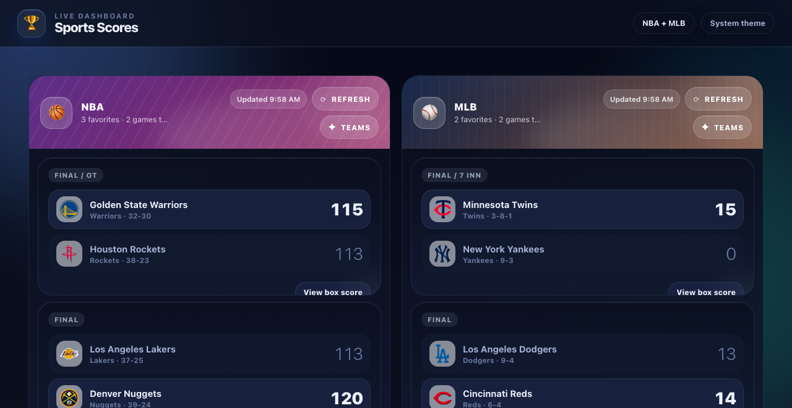

# Sports Scores

> A local web app for tracking live NBA and MLB scores.



## Features

- **Live & scheduled scores** — NBA and MLB games via ESPN's public API (no key required)
- **Draggable, resizable widgets** — powered by react-grid-layout; arrange the board however you like
- **Favorite teams** — pin preferred teams per sport; selections persist across sessions
- **Auto-refresh** — scores update every 30 seconds; pauses automatically when the browser tab is hidden (Page Visibility API)
- **Light / dark theme** — adapts to your system color scheme via CSS `prefers-color-scheme`
- **Persistent layout** — widget positions are saved to localStorage and restored on reload
- **Box scores** — open live/final games to view a team-vs-team stat breakdown from ESPN's summary endpoint

---

## Quick Start

- Install dependencies:

```bash
cd sports-scores/server && npm install

cd sports-scores/client && npm install
```

- Run the API and client in separate terminals:

```bash
# Terminal 1 — API server
cd sports-scores/server
npm run dev

# Terminal 2 — Frontend dev server
cd sports-scores/client
npm run dev
```

Open **http://localhost:3000** in your browser.

---

## Documentation

- [Getting Started](./docs/getting-started.md) — prerequisites, install steps, scripts, and local development workflow
- [Architecture](./docs/architecture.md) — stack overview, project structure, data flow, and persistence details
- [API Reference](./docs/api.md) — backend endpoints and normalized response shapes
